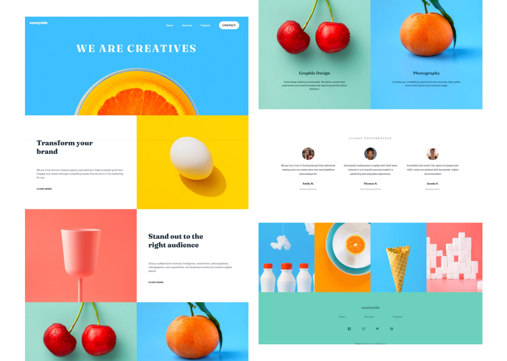
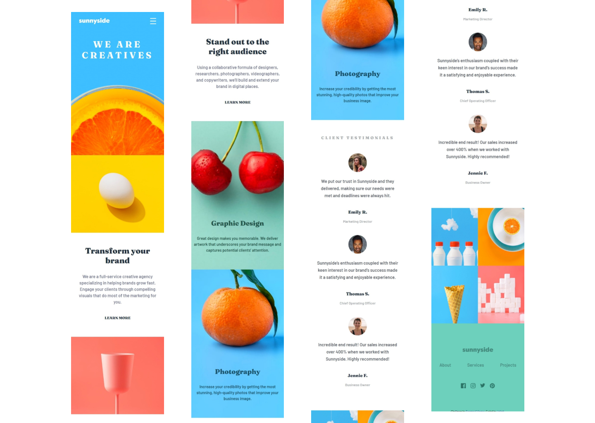

# Frontend Mentor - Sunnyside agency landing page solution

This is a solution to the [Sunnyside agency landing page challenge on Frontend Mentor](https://www.frontendmentor.io/challenges/sunnyside-agency-landing-page-7yVs3B6ef). Frontend Mentor challenges help you improve your coding skills by building realistic projects.

## Table of contents

- [Overview](#overview)
  - [The challenge](#the-challenge)
  - [Screenshot](#screenshot)
  - [Links](#links)
- [My process](#my-process)
  - [Built with](#built-with)
  - [What I learned](#what-i-learned)
  - [Continued development](#continued-development)
  - [Useful resources](#useful-resources)
- [Author](#author)


**Note: Delete this note and update the table of contents based on what sections you keep.**

## Overview

### The challenge

Users should be able to:

- View the optimal layout for the site depending on their device's screen size
- See hover states for all interactive elements on the page

### Screenshot




### Links

- Solution URL: [Github](https://github.com/atikahnaz/sunnyside-agency-landing-page-main/blob/main/index.html)
- Live Site URL: [Live site](https://your-live-site-url.com)

## My process

### Built with

- Semantic HTML5 markup
- CSS custom properties
- Flexbox
- CSS Grid
- Mobile-first workflow

### What I learned

1. Overflow may happen when other images width were not set first.
2. Without css layout, the page already act as responsive web.
3. to create hero image, set div using background-image.
```css
.hero-image {
    background-image: url("images/desktop/image-header.jpg");
    width: 100%;
    height: 90%;
    background-position: center;
    background-repeat: no-repeat;
    background-size: cover;
    position: relative;
}
```
4. to align text navigation bar with text-button, use align-item: center;
```css
.desktop-nav {
        display: flex;
        justify-content: space-between;
        align-items: center;
        width: 500px;
        padding-right: 2rem;
    }
```
5. change color svg logo using <svg> tag (not  tag)by changing fill properties.

6. To change grid order, use grid-template-areas and grid area.
```css
.transform {
        display: grid;
        grid-template-columns: 1fr 1fr;
        grid-template-areas: "mainText" "transformImage";
        
    }
    .transform-image {
        width: 100%;
        position: relative
        grid-area: transformImage;
    }
    .transform .main-text {
        grid-area: mainText;
    }
```

### Continued development

Popup navigation bar

### Useful resources

- [Hero image](https://www.w3schools.com/howto/howto_css_hero_image.asp) - This explain how to create hero image. The image focus to the center in small screen and display full image in wide screen.

## Author

- Frontend Mentor - [@atikahnaz](https://www.frontendmentor.io/profile/atikahnaz)